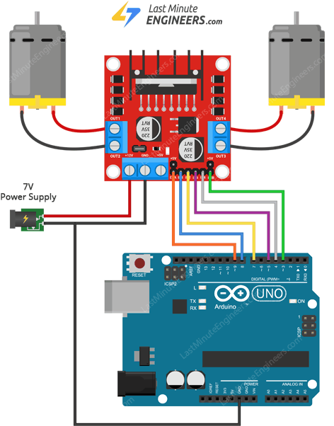
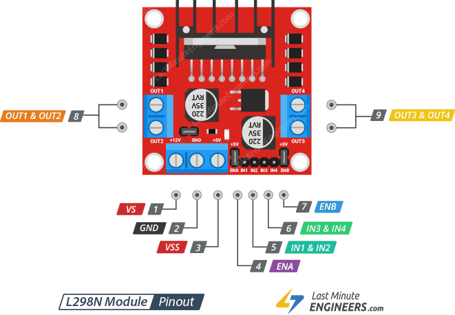

<!-- _class: lead -->
<div class="hero">
  <div class="hero-copy">
    <div class="kicker">Arduino UNO R3 · 10 min teaching demo</div>
    <h1>PWM 与<br><span class="accent">电机控制</span></h1>
    <p class="sub" style="margin-top:22px;">从 LED 调光，到让电机稳定地转起来。</p>
    <div style="margin-top:28px;"><span class="pill">占空比</span><span class="pill">定时器</span><span class="pill">驱动器</span><span class="pill">反馈</span></div>
  </div>
  <div class="text-card" style="width:39%; padding:27px 30px;">
    <h3>这节课只回答一个问题</h3>
    <p style="font-size:27px; line-height:1.38; color:#243b56;">Arduino 的引脚只有高、低两种状态，为什么还能改变亮度和电机速度？</p>
    <p class="small" style="margin-top:20px;">主线：先看波形，再看定时器，最后把控制信号送进电机驱动器。</p>
  </div>
</div>

---

### 1 · 先把概念说准确
## PWM 是“快速开关”，不是“输出模拟电压”

<div class="cols" style="margin-top:20px; align-items:flex-start;">
  <div class="col text-card">
    <h3>三个量</h3>
    <ul class="body-list">
      <li><strong>周期 T</strong>：一个高电平加一个低电平的时间。</li>
      <li><strong>频率 f = 1 / T</strong>：每秒重复多少次。</li>
      <li><strong>占空比 D = T<sub>on</sub> / T</strong>：高电平占一个周期的比例。</li>
    </ul>
  </div>
  <div class="col text-card">
    <h3>一个容易混淆的点</h3>
    <p>引脚瞬时电压仍然只在 <strong>0 V 与 5 V</strong> 之间切换。所谓“平均电压”是负载在一段时间内感受到的等效效果。</p>
    <p class="small">理想情况下，平均值可写作 <code>V̄ ≈ D · V<sub>H</sub></code>；这不等于所有负载都真的得到一个平滑的直流电压。</p>
  </div>
</div>
<div class="callout" style="margin-top:23px;">PWM 的核心不是把 5 V 变成某个固定电压，而是把“导通多久”变成可控参数。</div>

---

### 2 · 看懂波形，才不会把参数用错
## 占空比改变强度，频率决定时间尺度

<div class="cols" style="margin-top:15px; align-items:flex-start;">
  <div class="col">
    <div class="wave-card"><div class="wave-head"><span class="wave-label">25% duty</span><span class="wave-meta">T<sub>on</sub> 短</span></div><div class="wave-track"><div class="pulse p25"></div><span class="cursor"></span></div></div>
    <div class="wave-card"><div class="wave-head"><span class="wave-label">50% duty</span><span class="wave-meta">高低各半</span></div><div class="wave-track"><div class="pulse p50"></div><span class="cursor"></span></div></div>
    <div class="wave-card"><div class="wave-head"><span class="wave-label">75% duty</span><span class="wave-meta">T<sub>on</sub> 长</span></div><div class="wave-track"><div class="pulse p75"></div><span class="cursor"></span></div></div>
  </div>
  <div class="col text-card" style="margin-top:9px;">
    <h3>固定占空比，改变频率</h3>
    <div class="wave-card"><div class="wave-head"><span class="wave-label">低频</span><span class="wave-meta">更容易闪烁、听到啸叫</span></div><div class="wave-track"><div class="pulse slow"></div></div></div>
    <div class="wave-card"><div class="wave-head"><span class="wave-label">高频</span><span class="wave-meta">更平滑，但开关损耗可能增加</span></div><div class="wave-track"><div class="pulse fast"></div></div></div>
    <p class="small" style="margin-top:13px;"><strong>结论：</strong>调速先改 D；遇到可见闪烁、噪声或驱动器限制，再讨论 f。</p>
  </div>
</div>

---

### 3 · 为什么平均值能产生效果
## 负载的“惯性”把脉冲变成可观察结果

<div class="cols" style="margin-top:24px; align-items:stretch;">
  <div class="col text-card">
    <h3>LED</h3>
    <p>人眼对快速亮灭进行时间平均，所以高频 PWM 下看起来像连续调光。</p>
    <p class="small">LED 仍需串联限流电阻；PWM 不能替代限流。</p>
  </div>
  <div class="col text-card">
    <h3>电机</h3>
    <p>线圈电感限制电流突变，机械惯性平滑速度变化。相同工况下增大 D 通常提高加速转矩；稳态转矩由负载决定。</p>
    <p class="small">启动、低速和负载突变时，电流与速度不会立刻跟随命令。</p>
  </div>
</div>
<div class="note" style="margin-top:25px;"><strong>功率要小心：</strong>纯电阻负载的 PWM 平均功率约为 <code>P = D · V<sub>H</sub><sup>2</sup> / R</code>，不能把平均电压 <code>D·V<sub>H</sub></code> 直接平方后当作同一结果。</div>

---

### 4 · Arduino 到底做了什么
## `analogWrite()` 背后是定时器比较输出

<div class="cols" style="margin-top:20px; align-items:flex-start;">
  <div class="col text-card">
    <h3>抽象成三步</h3>
    <div class="flow" style="margin:16px 0 20px;">
      <div class="flow-box signal">计数器<br><code>TCNT</code></div><div class="arrow">→</div><div class="flow-box signal">比较值<br><code>OCR</code></div><div class="arrow">→</div><div class="flow-box power">输出翻转</div>
    </div>
    <p class="small">Fast PWM 向上计数后归零；Phase Correct PWM 在 0 与 TOP 间往返。硬件根据比较匹配及计数边界改变输出。</p>
  </div>
  <div class="col text-card">
    <h3>和 STM32 术语的对应</h3>
    <table>
      <thead><tr><th>功能</th><th>Arduino AVR</th><th>STM32 常见称呼</th></tr></thead>
      <tbody><tr><td>当前计数</td><td><code>TCNT</code></td><td><code>CNT</code></td></tr><tr><td>周期上限</td><td><code>TOP</code></td><td><code>ARR</code></td></tr><tr><td>比较阈值</td><td><code>OCR</code></td><td><code>CCR</code></td></tr></tbody>
    </table>
    <p class="small" style="margin-top:11px;">三者遵循同一条链：时钟 → 计数 → 比较 → 输出。</p>
  </div>
</div>

---

### 5 · UNO R3 的 PWM 资源
## 引脚、定时器和副作用要一起记

<table style="margin-top:20px;">
  <thead><tr><th>引脚</th><th>定时器</th><th>UNO 常见频率</th><th>适合的课堂用途</th></tr></thead>
  <tbody>
    <tr><td><strong>D3、D11</strong></td><td>Timer2</td><td>约 490 Hz</td><td>适合一般 LED / 电机控制</td></tr>
    <tr><td><strong>D5、D6</strong></td><td>Timer0</td><td>约 980 Hz</td><td>Timer0 还支撑 <code>millis()</code>、<code>delay()</code></td></tr>
    <tr><td><strong>D9、D10</strong></td><td>Timer1</td><td>约 490 Hz</td><td>硬件 16 位；默认 analogWrite 为 8 位范围</td></tr>
  </tbody>
</table>
<div class="cols" style="margin-top:22px;">
  <div class="note col"><strong>analogWrite(pin, value)：</strong><code>value = 0</code> 表示全关，<code>255</code> 表示全开，中间值近似映射到 0～100% 占空比。</div>
  <div class="note col"><strong>不要随意改 Timer0：</strong>改变其分频或模式，可能让 <code>millis()</code> 和 <code>delay()</code> 失准。</div>
</div>

---

### 6 · 第一个可验证实验
## 用 D9 做呼吸灯：参数更新慢，PWM 本身很快

<div class="cols" style="margin-top:18px; align-items:flex-start;">
  <div class="col">

```cpp
const byte LED = 9;       // UNO PWM 引脚
int duty = 0;
int step = 5;

void setup() { pinMode(LED, OUTPUT); }

void loop() {
  analogWrite(LED, duty); // 只改变占空比命令
  duty += step;
  if (duty <= 0 || duty >= 255) step = -step;
  duty = constrain(duty, 0, 255);
  delay(20);              // 改变“渐变速度”，不是 PWM 频率
}
```

  </div>
  <div class="col text-card">
    <h3>讲代码时抓住三层时间尺度</h3>
    <ol class="body-list">
      <li><strong>约 490 Hz：</strong>硬件 PWM 周期，约 2 ms。</li>
      <li><strong>20 ms：</strong>主循环多久改一次占空比。</li>
      <li><strong>0→255：</strong>亮度目标如何变化；线性变化不一定等于人眼感知的线性。</li>
    </ol>
    <p class="small" style="margin-top:12px;">这正是博客中“逐步修改比较值”思路在 Arduino 上的简化实现。</p>
  </div>
</div>

---

### 7 · 把阻塞式写法改成可扩展程序
## `millis()` 让 PWM、串口和传感器同时运行

<div class="cols" style="margin-top:17px; align-items:flex-start;">
  <div class="col">

```cpp
const byte LED = 9;
int duty = 0, step = 5;
unsigned long lastUpdate = 0;
const unsigned long interval = 20;

void setup() {
  pinMode(LED, OUTPUT);
  Serial.begin(115200);
}

void loop() {
  unsigned long now = millis();
  if (now - lastUpdate >= interval) {
    lastUpdate = now;
    duty += step;
    if (duty >= 255 || duty <= 0) step = -step;
    duty = constrain(duty, 0, 255);
    analogWrite(LED, duty);
    Serial.println(duty);
  }
  // 这里可以继续读取按键、编码器或超声波传感器
}
```

  </div>
  <div class="col text-card">
    <h3>从示例中迁移出的编程习惯</h3>
    <ol class="body-list">
      <li><code>millis()</code> 只提供时间戳，不会暂停 CPU。</li>
      <li>用 <code>now - lastUpdate</code> 处理计时，避免溢出问题。</li>
      <li>把“计算目标值”和“输出 PWM”放在同一个周期任务中。</li>
      <li>串口打印用于观察占空比，实际控制中应限制打印频率。</li>
    </ol>
  </div>
</div>
<div class="note" style="margin-top:14px;"><code>delay()</code> 会暂停主循环；<code>millis()</code> 允许测速、避障和通信继续运行。</div>

---

### 8 · 从 LED 到电机
## Arduino 负责发命令，驱动器负责承受电流

<div class="flow" style="margin-top:28px;">
  <div class="flow-box signal"><strong>Arduino</strong><br><span class="small">PWM + 方向</span></div><div class="arrow">→</div>
  <div class="flow-box signal"><strong>驱动器</strong><br><span class="small">MOSFET / H 桥</span></div><div class="arrow">→</div>
  <div class="flow-box power"><strong>电机</strong><br><span class="small">电流、转矩、速度</span></div>
</div>
<div class="cols" style="margin-top:27px;">
  <div class="col text-card"><h3>为什么不能直连</h3><p>电机启动电流可能远超 I/O 承受能力；关断时线圈电感产生电压尖峰，需要续流路径。L298N 使用双极型晶体管 H 桥。</p></div>
  <div class="col text-card"><h3>接线最少原则</h3><p>电机用独立电源；Arduino、驱动器逻辑地和电源地按模块要求连接；电机两端接驱动器输出，不接 Arduino 引脚。</p></div>
</div>

---

### 9 · 硬件接线
## Arduino 只发逻辑信号，电机电流走独立功率回路

<div class="cols" style="margin-top:18px; align-items:flex-start;">
  <div style="width:40%; text-align:center;">
    
    <p class="tiny">图源：<a href="https://lastminuteengineers.com/l298n-dc-stepper-driver-arduino-tutorial/">Last Minute Engineers</a>（双通道示例）</p>
  </div>
  <div class="col">
    <h3>本课单电机代码对应接线</h3>
    <table><thead><tr><th>Arduino / 电源</th><th>L298N 模块</th></tr></thead><tbody>
      <tr><td>D5 / D7 / D8</td><td>ENA / IN1 / IN2</td></tr>
      <tr><td>Arduino GND、电源负极</td><td>GND，共地</td></tr>
      <tr><td>电机电源正极</td><td>VS（常标 +12V）</td></tr>
      <tr><td>电机两端</td><td>OUT1 / OUT2</td></tr>
    </tbody></table>
    <p style="margin-top:15px; font-size:20px;"><strong>拔掉 ENA 跳线帽</strong>，再接 D5 的 PWM 信号。ENA 跳线帽与 5V 稳压跳线帽作用不同。</p>
    <p class="small">图中双电机示例的引脚分配不同，运行本课程序时按右表连接。VS 标注不是固定供电要求，应匹配电机及模块额定范围。</p>
  </div>
</div>

---

### 10 · 以 L298N 为例读懂控制接口
## 方向是逻辑量，速度是 PWM 量

<div class="cols" style="margin-top:17px; align-items:flex-start;">
  <div class="col text-card">
    <table>
      <thead><tr><th>输入</th><th>作用</th><th>典型连接</th></tr></thead>
      <tbody><tr><td><code>ENA</code></td><td>通道使能 / PWM</td><td>UNO D5（PWM）</td></tr><tr><td><code>IN1, IN2</code></td><td>H 桥方向逻辑</td><td>UNO D7、D8</td></tr><tr><td><code>OUT1, OUT2</code></td><td>接直流电机</td><td>电机两端</td></tr><tr><td><code>VS</code></td><td>电机电源</td><td>外部电池</td></tr></tbody>
    </table>
    
  </div>
  <div class="col">

```cpp
const byte ENA = 5;
const byte IN1 = 7, IN2 = 8;

void setMotor(int command) {
  command = constrain(command, -255, 255);
  if (command > 0) {
    digitalWrite(IN1, HIGH); digitalWrite(IN2, LOW);
    analogWrite(ENA, command);
  } else if (command < 0) {
    digitalWrite(IN1, LOW); digitalWrite(IN2, HIGH);
    analogWrite(ENA, -command);
  } else {
    analogWrite(ENA, 0);
    digitalWrite(IN1, LOW); digitalWrite(IN2, LOW);
  }
}

```

  </div>
</div>

---

### 10B · 电机程序的初始化与调用
## 按键接 D2 与 GND，按下时读取 LOW

<div class="cols" style="margin-top:18px; align-items:flex-start;">
  <div class="col">

```cpp
// 与上一页的引脚定义、setMotor() 放在同一程序中
const byte BUTTON = 2;

void setup() {
  pinMode(ENA, OUTPUT);
  pinMode(IN1, OUTPUT); pinMode(IN2, OUTPUT);
  pinMode(BUTTON, INPUT_PULLUP);
  setMotor(0);
}

void loop() {
  if (digitalRead(BUTTON) == LOW) {
    setMotor(150);       // 按下：正转
  } else {
    setMotor(0);         // 松开：停止
  }
}
```

  </div>
  <div class="col text-card">
    <h3>命令含义</h3>
    <p><code>setMotor(150)</code>：按接线定义正转。</p>
    <p><code>setMotor(-150)</code>：反转。</p>
    <p><code>setMotor(0)</code>：关闭使能，自由滑行停止，不是主动制动。</p>
    <p class="small">换向前先关闭 PWM，等待电机减速，再改变方向，避免高速直接反转。</p>
    <h3>逻辑电源</h3>
    <p class="small">UNO 由 USB 供电。L298N 的逻辑端还需 5V：按模块规格选择板载稳压或外部 5V，启用稳压时不可将其 5V 输出并接另一电源。</p>
  </div>
</div>

---

### 11 · 解释“同样数值，速度不同”
## PWM 命令不是转速传感器

<div class="cols" style="margin-top:20px; align-items:flex-start;">
  <div class="col text-card">
    <h3>电机的简化模型</h3>
    <p style="font-size:25px; color:#173b62;"><code>V = Ri + L·di/dt + K<sub>e</sub>ω</code></p>
    <p style="font-size:25px; color:#173b62;"><code>τ = K<sub>t</sub>i</code></p>
    <p class="small">电流产生转矩；速度升高后反电动势变大，电流和转矩会受到抑制。</p>
  </div>
  <div class="col text-card">
    <h3>实际误差来自哪里</h3>
    <ul class="body-list">
      <li>左右电机参数、齿轮和轮胎摩擦不同。</li>
      <li>电池电压下降，驱动器压降随电流变化。</li>
      <li>地面坡度、负载和启动阈值改变。</li>
    </ul>
  </div>
</div>
<div class="callout" style="margin-top:25px;"><strong>开环：</strong>给一个 PWM 数值，期待某个速度。<span style="margin-left:18px;"><strong>闭环：</strong>编码器测速度，用误差继续调整 PWM。</span></div>

---

### 12 · 控制回路的基本流程
## 闭环系统每个采样周期都在“测量—比较—修正”

<div class="flow" style="margin-top:28px;">
  <div class="flow-box signal"><strong>设定值 r</strong><br><span class="small">目标速度</span></div><div class="arrow">→</div>
  <div class="flow-box signal"><strong>比较器</strong><br><span class="small">e = r − y<sub>m</sub></span></div><div class="arrow">→</div>
  <div class="flow-box signal"><strong>控制器</strong><br><span class="small">PI / PID</span></div><div class="arrow">→</div>
  <div class="flow-box power"><strong>执行器</strong><br><span class="small">PWM + 驱动器</span></div><div class="arrow">→</div>
  <div class="flow-box power"><strong>电机与负载</strong><br><span class="small">输出速度 y</span></div>
</div>
<div class="flow" style="margin-top:3px; justify-content:flex-end; padding-right:198px;">
  <div class="flow-box power" style="min-width:250px; padding:10px 14px;"><strong>编码器测速 y<sub>m</sub></strong><br><span class="small">输出经过测量与计算</span></div>
  <div class="arrow">↶</div><div class="small" style="max-width:290px;">反馈到比较器，下一次计算 <code>e = r − y<sub>m</sub></code></div>
</div>
<div class="cols" style="margin-top:15px;">
  <div class="col text-card"><h3>开环</h3><p>输出可以被测量或记录，但不参与控制量的自动修正。是否存在输出反馈，决定回路是否闭合。</p></div>
  <div class="col text-card"><h3>闭环</h3><p>输出被传感器测量并反馈。负载变大导致速度下降时，误差增大，控制器会提高 PWM 进行补偿。</p></div>
</div>

---

### 13 · 开环与闭环：控制学上的区别
## 关键差别是“是否用输出参与下一次决策”

<table style="margin-top:20px;">
  <thead><tr><th>比较项</th><th>开环控制</th><th>闭环控制</th></tr></thead>
  <tbody>
    <tr><td>决策依据</td><td>预先设定的 PWM 或标定表</td><td>设定值与测量值的误差</td></tr>
    <tr><td>输出反馈</td><td>可以测量，但不用于修正控制量</td><td>输出的测量或估计值参与反馈</td></tr>
    <tr><td>抗扰动能力</td><td>负载、电池变化会直接造成偏差</td><td>能通过反馈主动修正偏差</td></tr>
    <tr><td>实现代价</td><td>代码、硬件和调试都简单</td><td>需要测速、采样、控制器和参数整定</td></tr>
    <tr><td>典型例子</td><td>设 <code>analogWrite(ENA, 150)</code> 让电机转</td><td>目标 100 rpm，编码器测得 92 rpm 后提高 PWM</td></tr>
  </tbody>
</table>
<div class="callout" style="margin-top:21px;">闭环不保证“永远正确”：传感器噪声、采样延迟和控制参数不合适，仍可能造成抖动、超调甚至振荡。</div>

---

### 14 · 把课堂变成可复现实验
## 先测量，再调参

<div class="cols" style="margin-top:21px; align-items:flex-start;">
  <div class="col">
    <table>
      <thead><tr><th>步骤</th><th>设置</th><th>记录</th></tr></thead>
      <tbody><tr><td>1. 空载</td><td>80 / 120 / 160 / 200</td><td>是否启动、噪声</td></tr><tr><td>2. 负载</td><td>相同 PWM 重复测试</td><td>电机电流、速度变化</td></tr><tr><td>3. 双轮</td><td>左右轮分别测试</td><td>直行偏差、补偿量</td></tr></tbody>
    </table>
  </div>
  <div class="col text-card">
    <h3>故障排查顺序</h3>
    <ol class="body-list">
      <li>代码是否在运行、串口输出是否更新。</li>
      <li>引脚是否真的支持 PWM，ENA 是否接到 PWM 脚。</li>
      <li>驱动器电源、Arduino 与驱动器共地是否正确。</li>
      <li>最后再调占空比、方向和左右轮补偿。</li>
    </ol>
  </div>
</div>

---

### 15 · 用三个问题检查是否真的理解
## 让听众说出因果链，而不是背定义

<div class="cols" style="margin-top:25px; align-items:stretch;">
  <div class="col text-card"><h3>问题 A</h3><p>把 <code>delay(5)</code> 改成 <code>delay(50)</code>，改变的是 PWM 频率还是渐变速度？</p><p class="small"><strong>答案：</strong>渐变速度；硬件定时器仍按原频率输出。</p></div>
  <div class="col text-card"><h3>问题 B</h3><p>为什么 50% 占空比不能直接说成“引脚输出 2.5 V”？</p><p class="small"><strong>答案：</strong>瞬时电平仍是 0 / 5 V，2.5 V只是理想平均值。</p></div>
  <div class="col text-card"><h3>问题 C</h3><p>为什么电机不转时，第一步不是把 PWM 调到 255？</p><p class="small"><strong>答案：</strong>先查供电、共地、使能和启动电流，避免把接线问题变成硬件损坏。</p></div>
</div>

---

### 16 · 进阶只留一条主线
## 从“能转”走向“可控”

<div class="flow" style="margin-top:30px;">
  <div class="flow-box signal">固定 PWM<br><span class="small">开环</span></div><div class="arrow">→</div>
  <div class="flow-box signal">编码器测速<br><span class="small">获得反馈</span></div><div class="arrow">→</div>
  <div class="flow-box power">PI / PID<br><span class="small">修正误差</span></div><div class="arrow">→</div>
  <div class="flow-box power">稳定速度<br><span class="small">可复现实验</span></div>
</div>
<div class="cols" style="margin-top:28px;">
  <div class="col text-card"><h3>硬件进阶</h3><p>比较不同驱动器的压降、峰值电流、续流路径和 PWM 频率限制。</p></div>
  <div class="col text-card"><h3>软件进阶</h3><p>把阻塞式 <code>delay()</code> 改为 <code>millis()</code> 调度，让测速、通信和控制同时运行。</p></div>
  <div class="col text-card"><h3>算法进阶</h3><p>给电机建立 PWM—速度标定表，再加入闭环控制。</p></div>
</div>

---

### 17 · 参考资料
## 进一步阅读

<div class="cols" style="margin-top:21px; align-items:flex-start;">
  <div class="col text-card">
    <h3>本次内容的来源</h3>
    <ul class="body-list">
      <li>[CSDN] Arduino 学习：PWM 实现 LED 呼吸灯</li>
      <li>[CSDN] PWM 实现呼吸灯：定时器、ARR/CCR 与比较输出</li>
      <li>[Arduino] <code>analogWrite()</code> 语言参考</li>
      <li>[Arduino] Secrets of Arduino PWM</li>
    </ul>
  </div>
  <div class="col text-card">
    <h3>准备动手时再看</h3>
    <ul class="body-list">
      <li>Arduino Fading 示例：最小可运行的 LED PWM</li>
      <li>Arduino Blink Without Delay：非阻塞时间调度</li>
      <li>所用电机驱动器的数据手册：额定电压、电流、保护和接线</li>
    </ul>
  </div>
</div>
<p class="small" style="margin-top:16px;">硬件图片与接线参考：<a href="https://lastminuteengineers.com/l298n-dc-stepper-driver-arduino-tutorial/">Last Minute Engineers · L298N Motor Driver Tutorial</a></p>
